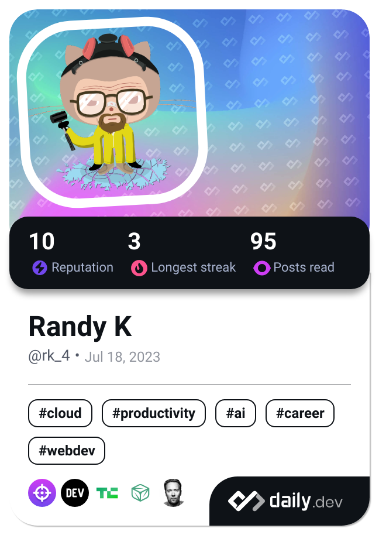

<h1 align="center">Hi There , I'm Randy... call me RK🕶️</h1>
<h3 align="center">A FullStack Web Dev</h3>
<!--  -->

<!-- -->

<!--  -->

<!--
**randy-kip/randy-kip** is a ✨ _special_ ✨ repository because its `README.md` (this file) appears on your GitHub profile.

Here are some ideas to get you started:

- 🔭 I’m currently working on ...
- 🌱 I’m currently learning ...
- 👯 I’m looking to collaborate on ...
- 🤔 I’m looking for help with ...
- 💬 Ask me about ...
- 📫 How to reach me: ...
- 😄 Pronouns: ...
- ⚡ Fun fact: ...
-->

      
      
   

---

- 🔭 I’m currently working on **Personal Portfolio/Freelance Prediction Data Analysis**
- 🌱 I’m currently deeply exploring **Quantum Computing**
- 💬 Ask me about **ReactJS and Ruby on Rails**

---

### 🧰 Languages and Tools

          

 

#
 

### 📊 Stats

<!--  -->

<!--  -->

<!-- 

 
&nbsp; -->

<!-- &nbsp; -->

<!-- 

 -->

<!--  -->
<!-- 

 -->
#

      
<h3>👨‍💻 RK</h3>

      
Amazing Projects Ahead!

