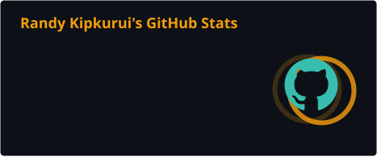
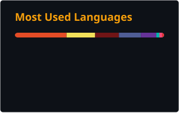

<!-- ============ HEADER ============ -->

  

  

  
  
  

---

<!-- ============ ABOUT ============ -->

### 👋 About me

I'm a **full-stack web developer** turned **AI & automation builder**. I help businesses go from
manual, spreadsheet-driven work to systems that run themselves — AI agents, custom CRMs,
workflow automation, and the web apps that tie it all together.

- 🚀 Building **[Kidaflow](https://kidaflow.com)** — taking businesses to the next level through transformation & growth
- 🤖 Building **[Simply Done Africa](https://simplydoneafrica.com)** — AI agents & automation for real estate and service companies in Kenya
- 🧠 Living in the agentic era: **Claude Code, Codex, MCP servers, n8n & Make**
- 🎓 Teaching businesses (and devs) how to actually put AI to work
- ⚛️ Still happy to talk **React, Next.js & Ruby on Rails** — and a bit of **Quantum Computing** 🔭

 

---

<!-- ============ AI STACK ============ -->
### 🤖 AI & Automation Stack

  
  
  
  
  
  
  
  
  
  
  

### 🧰 Languages & Frameworks

  

---

<!-- ============ PROJECTS ============ -->
### 🛠️ What I'm Building

| Project | What it does | Stack |
| --- | --- | --- |
| 🚀 **[Kidaflow](https://kidaflow.com)** | Business transformation & growth — strategy, systems and automation for SMEs | Web · AI · Automation |
| 🤖 **[Simply Done Africa](https://simplydoneafrica.com)** | AI customer service, custom CRMs, invoicing & lead gen for Kenyan real estate and service businesses | AI Agents · Automation |
| ✍️ **[LinkedIn Content Engine](https://github.com/randy-kip/Automated-LinkedIn-Content-Engine-with-GenAI-Capstone-Project)** | n8n + Make blueprints that research AI news and turn it into ready-to-post LinkedIn content | n8n · Make · GenAI |
| 🌐 **[3D Portfolio](https://github.com/randy-kip/randy_k_portfolio)** | Interactive portfolio with React Three Fiber and custom animations | React · Vite · R3F |
| 🛍️ **[Nahla Naturals](https://github.com/randy-kip/nahla-naturals)** | E-commerce store on Sanity CMS, plus an [M-Pesa Rails integration](https://github.com/randy-kip/ROR_Mpesa_nahla-naturals) | Next.js · Sanity · Rails |
| 📈 **[Freelance Prediction](https://github.com/randy-kip/freelance-prediction)** | Data analysis & ML on freelance market trends | Python · Jupyter |

---

<!-- ============ STATS ============ -->
### 📊 GitHub Stats

<!-- Cards are generated daily by .github/workflows/profile-cards.yml using the repo's own token — no external server to break. -->

  
  

  

  

---

<!-- ============ ACTIVITY ============ -->
### ⚡ Recent Activity

<!--START_SECTION:activity-->
<!--END_SECTION:activity-->

---

<!-- ============ CONNECT ============ -->
### 🤝 Let's Work Together

Want to automate your business, ship an AI agent, or just talk shop about Claude & Codex?

  
  
  

  

